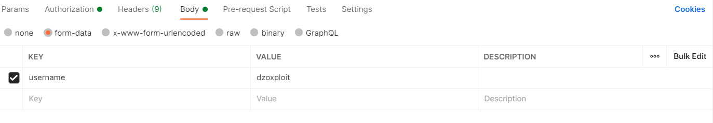
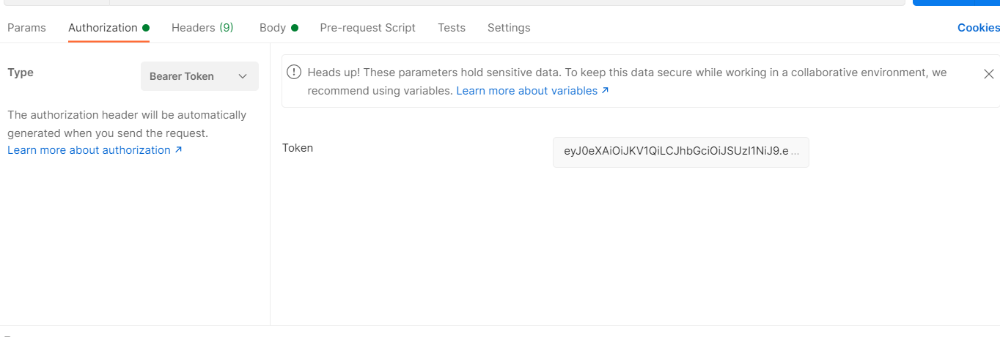
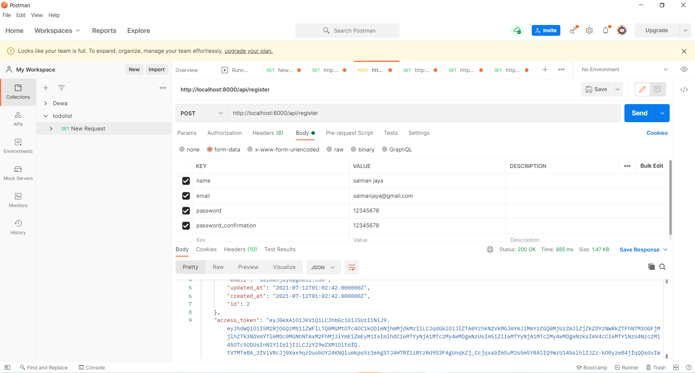
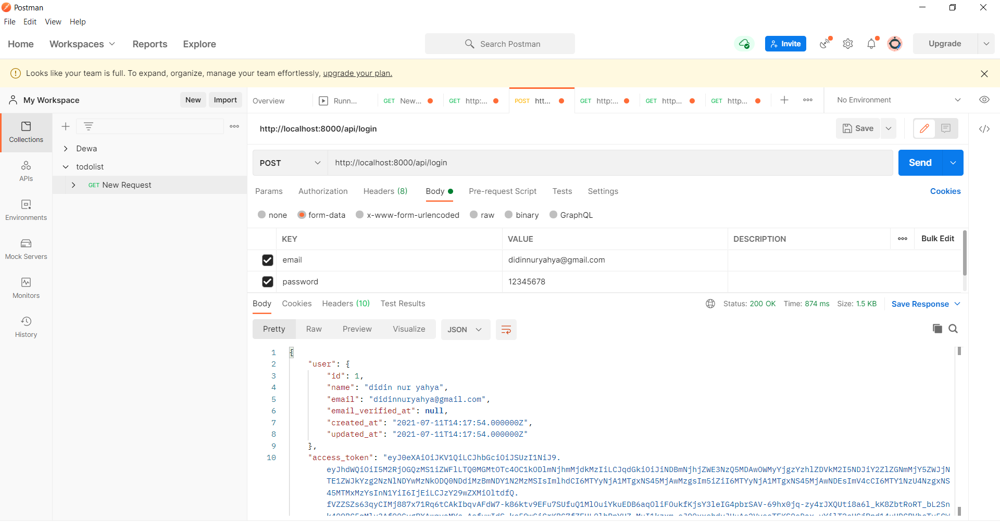
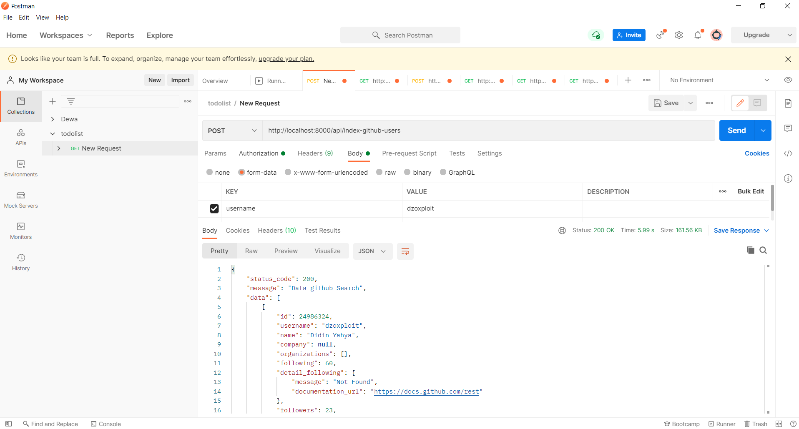

## About Exodust Beta
 
<h1>*route application</h1>
 
<h3>- auth</h3>
 
<h4>[post] http://localhost:8000/api/insert-github-users</h4> 
<h4>[post] http://localhost:8000/api/index-github-users/auth</h4> 
<h4>[get] http://localhost:8000/api/index-search-logs</h4> 
<h4>[get] http://localhost:8000/api/index-github-users-saved</h4> 
<h4>[get] http://localhost:8000/api/searching-github-users-saved?q={yoursearch}</h4> 
<h4>[post] http://localhost:8000/api/update-github-users/{id}</h4> 
<h4>[post] http://localhost:8000/api/delete-github-users/{id}</h4> 

<h3>- Non Auth</h3>
 
<h4>[post] http://localhost:8000/api/index-github-users</h4> 
<h4>[post] http://localhost:8000/api/register</h4> 
<h4>[post] http://localhost:8000/api/login</h4> 
<h4>[post] http://localhost:8000/api/login</h4> 

- How to make run Application

1. Download Zip application and extract 

2. Open command prompt and direct your folder typing 
    composer install
3. typing in command prompt
    php artisan migrate
    php artisan passport:install
4. download your redis and setting port redis 127.0.0.1:6379
5. typing in command prompt
    1-php artisan config:cache
    2-php artisan cache:clear
6. check helpers.php, ApiGithubUserController.php & GithubUserController.php and rename part code in below change to your username and password github.

  
$user = 'your-username';
 
  
$pwd = 'your-password';
 

</h1>*image route application</h1>
<h3>#route auth</h3>
 

 
 
 
 

 
 
 
 

<h3>#register</h3>
 

 
 
 
 

<h3>#login</h3>
 

 
 
 
 

<h3>#index github users</h3>
 

 
<h5>In Folder test2calculatehamming ready code for Bonus Challenge</h5> 
